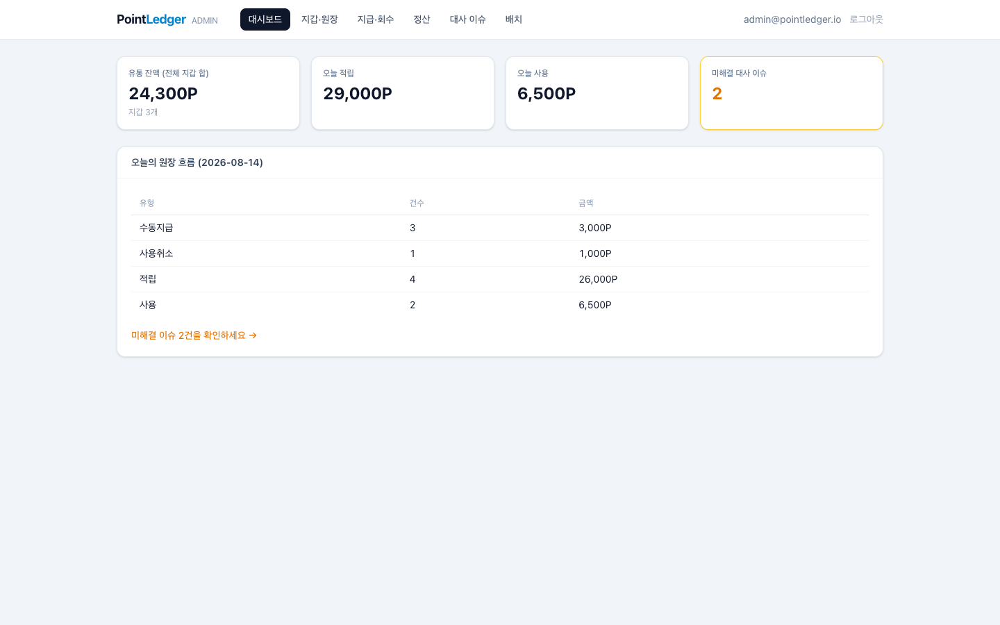
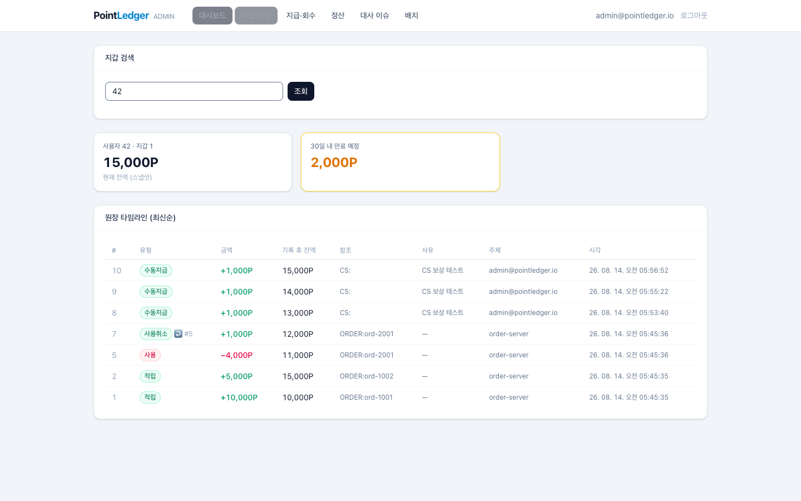
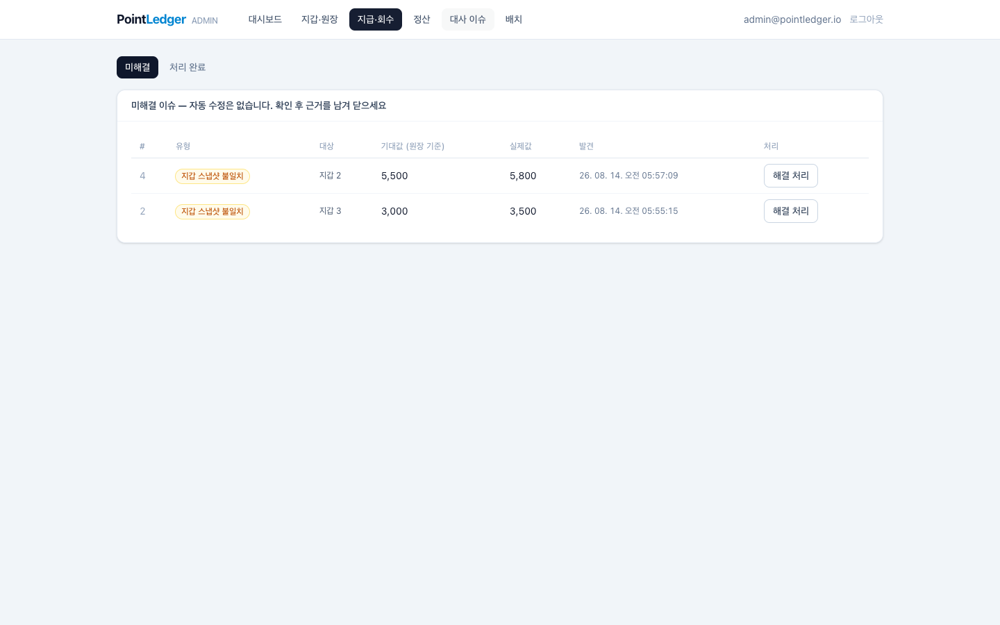
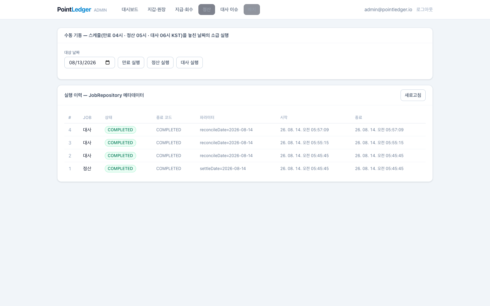

# PointLedger — 포인트 월렛·정산 시스템

> 적립·사용·만료·정산까지, **돈처럼 다뤄야 하는 포인트**를 append-only 원장으로 관리하는 백오피스 시스템.
> 원장이 진실이고 잔액은 파생값이며, 모든 포인트 변화는 반드시 원장 INSERT를 동반합니다.

[](https://github.com/Min0504/pointledger/actions)

| | |
|---|---|
| 핵심 문제 | 동시 사용 시 음수 잔액 · 재시도로 인한 이중 적립 · 수십만 건 일괄 만료 · 원장과 잔액의 불일치 |
| 해결 도구 | 비관적 락, 멱등성 키(요청 상태 테이블), Spring Batch 청크 재시작, 3단 대사(reconciliation) |
| 스택 | Java 17 · Spring Boot 3.5 · Spring Batch · PostgreSQL 16 · Flyway · ShedLock · React(어드민) |
| 테스트 | 통합 67건 — Testcontainers(실제 PostgreSQL), 동시성 재현, 프로퍼티 기반 불변식 검증 포함 |

## 왜 원장(ledger)인가

잔액을 `UPDATE wallets SET balance = balance - ?`로 고치는 시스템은 **"왜 이 값이 됐는지"를 설명하지 못합니다.**
PointLedger는 반대로 설계했습니다.

- **원장은 append-only.** 모든 변화(적립·사용·취소·만료·수동조정)는 `ledger_entries`에 한 줄씩 쌓이고, DB 트리거가 UPDATE/DELETE를 거부합니다.
- **잔액은 파생값.** `wallets.balance`는 원장의 합계를 캐시한 스냅샷일 뿐이며, 매일 대사 배치가 `SUM(ledger) == balance`를 검증합니다.
- **정정도 기록으로.** 운영자의 수동 지급/회수는 사유(reason)가 스키마 레벨로 강제되는 새 원장 행입니다. 과거를 고치지 않습니다.

## 문제 → 해결의 기록

각 단계는 **실패를 재현하는 테스트를 먼저 커밋하고, 해결로 통과시키는** 순서로 진행했습니다.
PR 본문에 재현 방법·격리수준 실험·설계 근거가 기록되어 있습니다.

| PR | 문제 | 해결 |
|----|------|------|
| [#1 foundation](https://github.com/Min0504/pointledger/pull/1) | 잔액 UPDATE 산재 시 감사 불가능 | append-only 원장 + 트리거 불변성 + 잔액 경유 규칙(LedgerService 단일 창구) |
| [#2 lost update](https://github.com/Min0504/pointledger/pull/2) | READ COMMITTED에서 동시 사용 → 잔액 증발 | 지갑 행 `SELECT ... FOR UPDATE` 직렬화 (+ [낙관적 락 비교 브랜치](https://github.com/Min0504/pointledger/tree/experiment/optimistic-retry)) |
| [#3 멱등성 키](https://github.com/Min0504/pointledger/pull/3) | 타임아웃 재시도 → 이중 적립 | Stripe 패턴: 키 선점(독립 커밋) → 작업+응답 저장(비즈니스 트랜잭션) → 재시도 시 응답 재생 |
| [#4 로트 FIFO](https://github.com/Min0504/pointledger/pull/4) | 만료일 다른 적립분의 소진 순서·부분 취소 | 로트 FIFO 차감 + 역순 복원 + 유예 로트, **1,000회 무작위 연산 프로퍼티 테스트**로 불변식 증명 |
| [#5 만료 배치](https://github.com/Min0504/pointledger/pull/5) | 수십만 로트 일괄 만료, 도중 사망 | Spring Batch 청크 + keyset 페이징, 재시작 멱등성, ShedLock 이중 기동 방어 |
| [#6 정산·대사](https://github.com/Min0504/pointledger/pull/6) | "틀렸다"를 발견하는 절차의 부재 | 가맹점 일일 정산(UNIQUE 멱등) + 3단 대사 → 이슈 적재, **자동 수정 금지** |

## 아키텍처

```text
[주문 서버 (mock)] --X-API-Key--> ┌──────────────────────────────┐
                                  │  Spring Boot API             │
[웹 어드민 React] ---JWT-------->  │  · LedgerService (단일 창구)  │ --> PostgreSQL 16
                                  │  · IdempotencyManager        │     · ledger_entries (append-only)
[스케줄러 cron] ----------------> │  · Spring Batch Jobs         │     · point_lots / lot_consumptions
                                  │    expire · settle · reconcile│     · settlements / reconcile_issues
                                  └──────────────────────────────┘     · shedlock / batch metadata
```

- **쓰기 경로는 하나.** 모든 credit/debit은 `LedgerService`가 지갑 행 락 안에서 원장 INSERT + 로트 갱신 + 잔액 스냅샷을 원자적으로 수행합니다.
- **배치와 온라인이 같은 락을 공유.** 만료 배치도 지갑 락을 잡으므로 온라인 사용과 경합해도 정합성이 깨지지 않습니다.
- **방어는 계층으로.** 애플리케이션 락 → 유니크 제약 → CHECK 제약 → append-only 트리거. "락이 뚫려도 데이터가 막는다."

상세 문서: [아키텍처·ERD](docs/architecture.md) · [격리수준 실험](docs/isolation-experiments.md) · [배치 설계](docs/batch-design.md) · [운영 runbook](docs/operations.md) · [incident 리포트](docs/incident/)

## 웹 어드민 (백오피스)

운영자가 원장을 눈으로 감사할 수 있는 화면입니다. 잔액이 왜 이 값인지 원장 타임라인으로 소명하고,
대사가 발견한 불일치를 근거와 함께 닫는 운영 절차를 시연합니다.

| 대시보드 | 원장 타임라인 |
|---|---|
|  |  |

| 대사 이슈 처리 | 배치 실행 이력 |
|---|---|
|  |  |

## 실행

```bash
# 1. 개발용 PostgreSQL (:55433)
docker compose -f docker-compose.dev.yml up -d

# 2. 백엔드 (:8081) — Flyway 마이그레이션 자동 적용
cd backend
JWT_SECRET=dev-jwt-secret-32bytes-minimum!! PL_ADMIN_PASSWORD=password1234 ./gradlew bootRun

# 3. 웹 어드민 (:5173) — /api를 백엔드로 프록시
cd frontend && npm install && npm run dev
```

- Swagger: <http://localhost:8081/docs> — 서버 간 API(적립/사용)는 화면 없이 여기서 데모
- 어드민 로그인: `admin@pointledger.io` / `PL_ADMIN_PASSWORD`로 지정한 값
- 서버 간 API는 `POST /admin/api-keys`로 발급한 `X-API-Key` + `Idempotency-Key` 헤더 필수

## 테스트

```bash
cd backend && ./gradlew test    # Testcontainers가 PostgreSQL 16을 직접 띄웁니다 (Docker 필요)
```

| 종류 | 대표 |
|------|------|
| 동시성 재현 | 락 없는 브랜치에서 lost update 실패 재현 → 락 적용 후 동일 시나리오 통과 |
| 프로퍼티 불변식 | earn/redeem/cancel 무작위 1,000회 → `SUM(ledger)==balance && 0<=lot.remaining<=initial` |
| 배치 재시작 | 3번째 청크에서 강제 사망 → 재기동 시 완료 청크 스킵, 이중 만료 0건 |
| 멱등성 계약 | 동시 중복 10건 → 정확히 1회 실행, 재시도는 `entryId`까지 동일한 응답 재생 |

## API 개요

| 구분 | 엔드포인트 | 인증 |
|------|-----------|------|
| 서버 간 | `POST /wallets` · `POST /points/earn` · `POST /points/redeem` · `POST /points/redeem/{id}/cancel` | X-API-Key + Idempotency-Key |
| 조회 | `GET /wallets/{userId}/balance` · `GET /wallets/{userId}/ledger` (커서 페이징) | X-API-Key 또는 ADMIN |
| 운영 | `POST /admin/points/grant·revoke` · `GET /admin/dashboard` · 정산/이슈/배치 관리 | JWT(ADMIN) |

## 저장소 구조

```text
pointledger/
├── backend/     # Spring Boot 3 + Spring Batch — 학습의 본체
│   └── src/main/resources/db/migration/   # Flyway V1~V5 (스키마가 곧 설계 문서)
├── frontend/    # 웹 어드민 React SPA — 시연용
└── docs/        # 기획서 · 아키텍처 · 실험 기록 · 운영 runbook · incident
```
