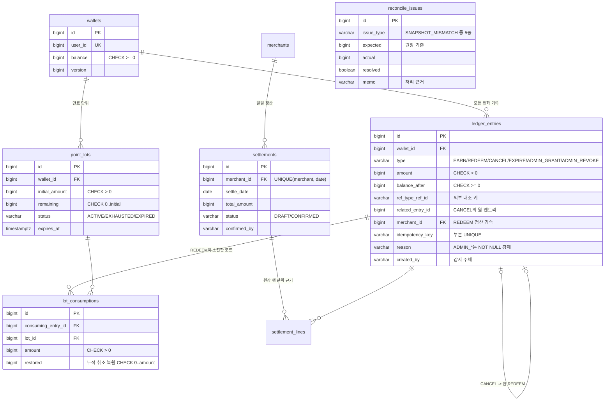

# 아키텍처

## 1. 시스템 구성

```text
                       X-API-Key (SHA-256 해시 대조)
[주문 서버 (mock)] ─────────────────────────────┐
                                                ▼
[웹 어드민 React] ──JWT(ADMIN)──▶  Spring Boot API (:8081)          PostgreSQL 16
                                  ├─ auth        운영자 로그인·API 키 발급      ├─ wallets
                                  ├─ wallet      지갑 생성·잔액·원장 조회       ├─ ledger_entries   ★ append-only
                                  ├─ ledger      모든 credit/debit의 단일 창구  ├─ point_lots
[cron 스케줄러] ──▶ Spring Batch  ├─ idempotency 멱등성 키 선점·응답 재생      ├─ lot_consumptions
  04시 만료                       ├─ batch       expire·settle·reconcile Job   ├─ idempotency_requests
  05시 정산                       ├─ settlement  가맹점·정산서 운영 API        ├─ merchants·settlements(+lines)
  06시 대사                       ├─ reconcile   대사 이슈 운영 API            ├─ reconcile_issues
                                  └─ admin       대시보드 집계                 ├─ external_order_records
                                                                              └─ shedlock·BATCH_* 메타데이터
```

- 프레임워크: Spring Boot 3.5 (Java 17), Spring Data JPA + 네이티브 집계 쿼리, Spring Batch 5, Flyway
- 비동기 없음(의도적): 포인트 차감은 주문 흐름의 동기 구간이다. 주문 완료 시점에 잔액이 확정되어야 하므로
  차감을 비동기화하면 "주문은 됐는데 포인트는 모름" 상태가 생긴다. 배치(만료·정산·대사)만 오프라인이다.

## 2. 설계 원칙

### 원장이 진실, 잔액은 파생값

| 원칙 | 구현 |
|------|------|
| 모든 변화는 원장 INSERT | `LedgerService`만 credit/debit 가능 — 컨트롤러·배치 모두 이 창구를 경유 |
| 원장은 불변 | DB 트리거 `trg_ledger_append_only`가 UPDATE/DELETE를 예외로 거부 |
| 잔액은 스냅샷 | `wallets.balance`는 원장 합계의 캐시. 대사 배치가 매일 `SUM(ledger) == balance` 검증 |
| 잔액은 캐시하지 않음 | 낡은 잔액은 UX 문제가 아니라 정합성 사고 — Redis 등 별도 캐시 계층을 의도적으로 배제 |

### 계층 방어 (defense in depth)

애플리케이션 로직이 뚫려도 데이터가 막는다. 각 계층은 독립적으로 동작한다.

```text
1층  지갑 행 비관적 락(FOR UPDATE)      동시 요청 직렬화
2층  UNIQUE 제약                        멱등성 키(부분 인덱스) · 정산 (merchant_id, settle_date)
3층  CHECK 제약                         balance >= 0 · amount > 0 · 0 <= remaining <= initial_amount
4층  append-only 트리거                 원장 행 조작 자체를 거부
```

## 3. ERD



주요 인덱스 (각각 목적이 다르다):

| 인덱스 | 목적 |
|--------|------|
| `ledger_entries (wallet_id, id DESC)` | 원장 타임라인 커서 페이징 — offset 없이 최신순 순회 |
| `ledger_entries (ref_type, ref_id)` | 외부(주문) 기록과의 대조 조인 |
| `ledger_entries (idempotency_key) WHERE NOT NULL` | 멱등성 2차 방어 — 부분 UNIQUE |
| `point_lots (wallet_id, expires_at, id) WHERE remaining > 0` | FIFO 소진 순서 스캔 — 살아있는 로트만 |
| `point_lots (expires_at) WHERE remaining > 0` | 만료 배치의 keyset 스캔 |
| `reconcile_issues (resolved, created_at DESC)` | 미해결 이슈 목록 |

## 4. 쓰기 경로 — 사용(redeem) 한 건의 흐름

```text
POST /points/redeem  (X-API-Key, Idempotency-Key)
  │
  ├─ [독립 TX] 멱등성 키 선점 — INSERT ... ON CONFLICT DO NOTHING
  │     충돌: DONE이면 저장된 응답 재생 / IN_PROGRESS면 409 + Retry-After
  │
  └─ [비즈니스 TX]
        1. SELECT wallet FOR UPDATE            ← 이 지갑의 모든 변화 직렬화
        2. 로트 FIFO 스캔 (만료 임박 순)        ← 부분 인덱스
        3. lot.remaining 차감 + lot_consumptions 기록
        4. ledger_entries INSERT (balance_after 포함)
        5. wallets.balance 갱신 (스냅샷)
        6. 멱등성 키 DONE + 응답 본문 저장      ← 같은 TX — 작업과 완료 기록의 원자성
```

트랜잭션을 두 개로 나눈 이유, 실패 창(window)별 동작은 [PR #3](https://github.com/Min0504/pointledger/pull/3) 참고.

## 5. 인증·인가

| 주체 | 방식 | 근거 |
|------|------|------|
| 주문 서버 | `X-API-Key` — SHA-256 해시만 저장, 키별 스코프 | 서버 간 통신에 세션·토큰 갱신은 과설계 |
| 운영자 | JWT(ADMIN) — 로그인 후 Bearer | 어드민 화면의 표준. 수동 지급/회수는 `created_by`에 이메일 기록 |
| 감사 | ADMIN_GRANT/REVOKE는 `reason` NOT NULL을 스키마로 강제 | "사유 없는 조작"을 코드 리뷰가 아니라 DB가 거부 |

## 6. 모듈 의존 규칙

```text
admin ─┐
auth  ─┼─▶ common (에러 코드·예외·보안 설정)
wallet ┤
batch ─┼─▶ ledger ─▶ wallet(엔티티)     ← credit/debit은 ledger 패키지만 가능
settlement ┤
reconcile ─┘
```

`LedgerService` 밖에서 `wallets.balance`를 갱신하거나 `ledger_entries`를 INSERT하는 코드는 리뷰에서 거부한다.
배치(만료)도 예외가 아니다 — `LedgerService.expireLots`를 호출해 같은 락 규율을 따른다.
